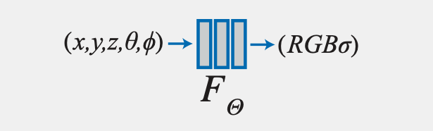
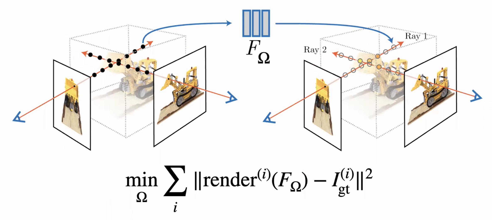
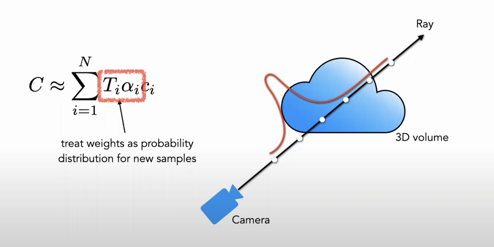
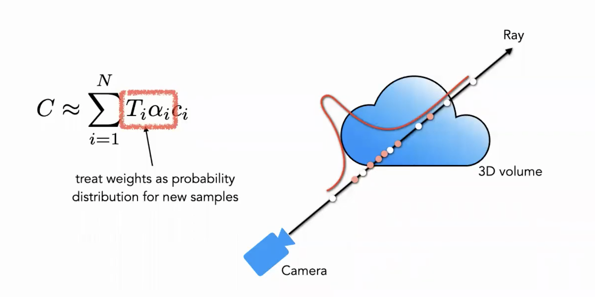
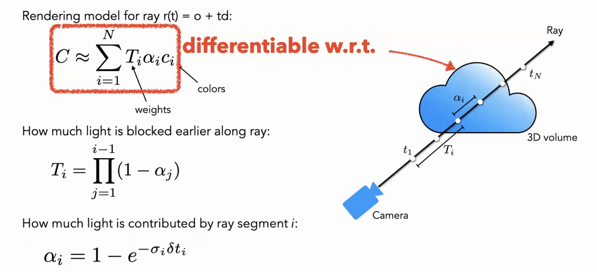
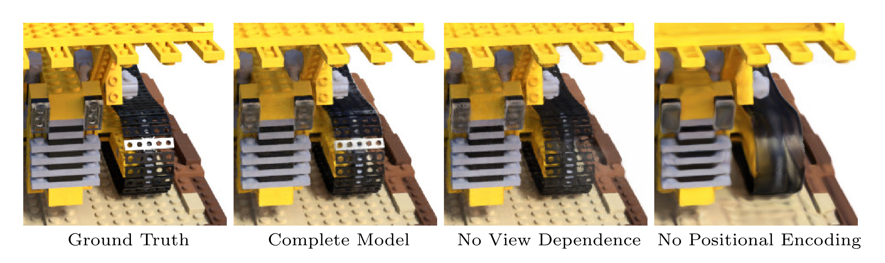
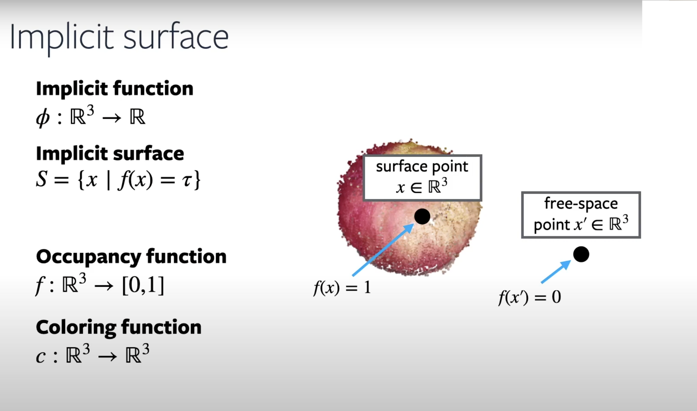
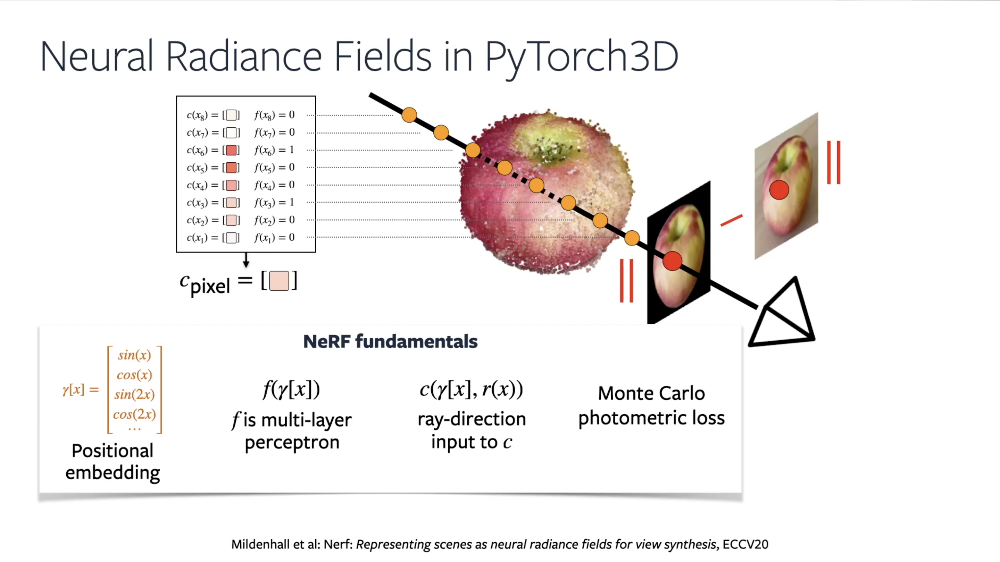
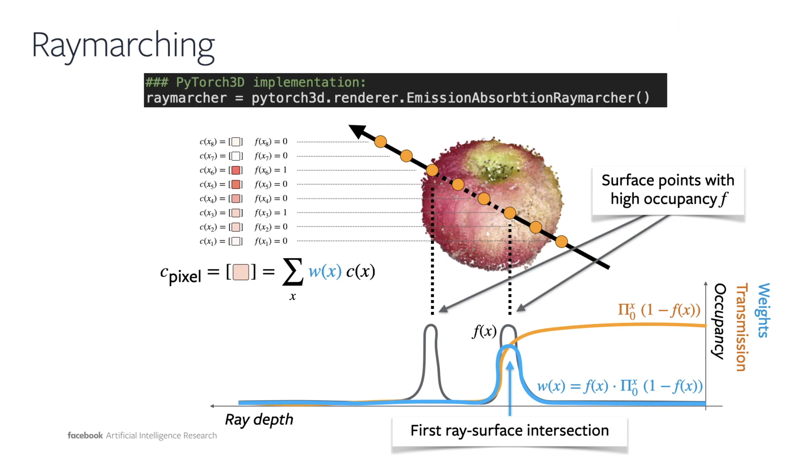

<!-- _class: invert -->
# NeRF - Neural Radiance Fields

# Implicit surfaces rendering in PyTorch3D

### 3D Graphics Systems - IMPA 2021 - Lab Class #10

<!--_footer: Based on [Matthew Tancik's presentation](https://youtu.be/dPWLybp4LL0)-->

---

# Goal

- Given a set of sparse views of a scene, we would like to learn how to render a new viewpoint of this scene.

---

# Strategy

- Scene is encoded in a neural network
  - Input: 3D spatial coordinates + 2D viewing direction coordinates
  - Output: 3D color + 1D density
* "Volumetric version of light field"

---

# View Dependent Effects

<video width="100%" height="80%" muted="" controls="" loop="" preload="metadata" poster="http://cseweb.ucsd.edu/~viscomp/projects/LF/papers/ECCV20/nerf/website_renders/images/viewdirs_website_bww.jpg">
  <source src="http://cseweb.ucsd.edu/~viscomp/projects/LF/papers/ECCV20/nerf/website_renders/viewdirs_website_bww.mp4" type="video/mp4">
Your browser does not support the video tag.
</video>

---

# Strategy

---

# Two Pass Rendering: Coarse

---
# Two Pass Rendering: Fine

---
# Volume Rendering is Differentiable

---

# Positional Encoding

<video width="100%" height="80%" muted="" autoplay="" loop="" preload="metadata" poster="http://cseweb.ucsd.edu/~viscomp/projects/LF/papers/ECCV20/nerf/website_renders/images/viewdirs_website_bww.jpg">
  <source src="https://storage.googleapis.com/nerf_data/website_renders/lion_none_gauss_v1.mp4" type="video/mp4">
Your browser does not support the video tag.
</video>

---

# Positional Encoding

- Learn on a higher dimensional space (from $R$ to $R^{2L}$)

$$\gamma(p) = (sin(2^0\pi p), cos(2^0\pi p), ..., sin(2^{L-1}\pi p), cos(2^{L-1}\pi p)) $$

- $\gamma(.)$ is applied separately to each coordinate

---

# Results

---

# Results

<video width="100%" height="100%" muted="" controls="" loop="" preload="metadata" poster="http://cseweb.ucsd.edu/~viscomp/projects/LF/papers/ECCV20/nerf/website_renders/images/depth_reflower.jpg">
  <source src="http://cseweb.ucsd.edu/~viscomp/projects/LF/papers/ECCV20/nerf/website_renders/depth_reflower.mp4" type="video/mp4">
Your browser does not support the video tag.
</video>

---
# Limitations

- Speed - hundreds of thousands of iterations for high-res
* Sampling resolution along rays
* Generalization - specific for one scene
  * No more? [PixelNeRF](https://alexyu.net/pixelnerf/) (CVPR, 2021 - happening NOW!)

---
<!-- _class: invert -->
# Implicit Surfaces in PyTorch3D

---

---

---

---
<!-- _class: invert -->
# Let's check the code on Colab!